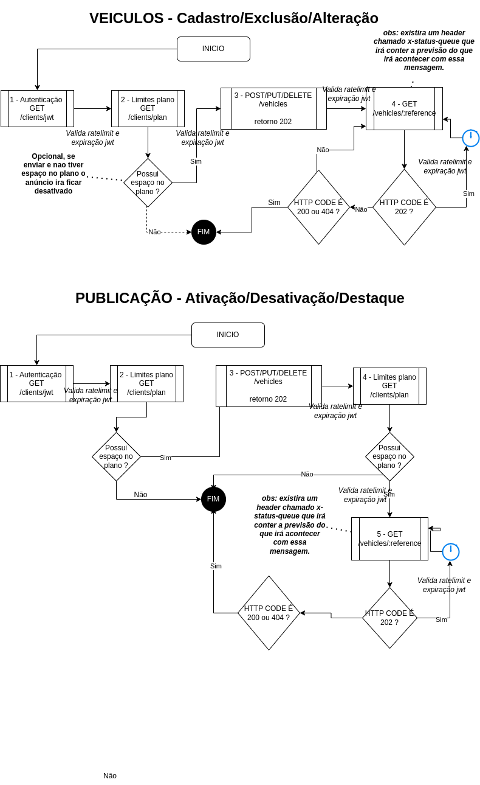

# API REST Veículos (v2)

- [Considerações iniciais](01-consideracoes-iniciais/index.md)
    - [Ambiente de testes](01-consideracoes-iniciais/test-environment.md)
    - [Ambiente de produção](01-consideracoes-iniciais/production-environment.md)
    - [Autenticação](01-consideracoes-iniciais/authentication.md)
    - [Limite de requisições](01-consideracoes-iniciais/limit-requests.md)
    - [Status de respostas das requisições](01-consideracoes-iniciais/status-request.md)
    - [Paginação e busca](01-consideracoes-iniciais/pagination-and-search.md)
- [Fluxo de execução da requisição - HEADER `x-status-queue`](05-previsao-execucao/index.md)
- [Veículos](02-veiculos/index.md)
    - [Endpoints](02-veiculos/vehicle-endpoints.md)
    - [Endpoints paginados](02-veiculos/vehicle-endpoints-paginated)    
    - [Objeto para criação e edição do veículo](02-veiculos/vehicle-object.md)
    - [Objeto de retorno /vehicles/:reference](02-veiculos/vehicle-return-object.md)

- [Cliente](03-cliente/index.md)
    - [Endpoints](03-cliente/client-endpoints.md)
    - [Objeto de informações do plano](03-cliente/plan-information-object.md)

- [Publicação](04-publicacao/index.md)
    - [Endpoints](04-publicacao/publication-endpoints.md)
    - [Objeto de informações da publicação](04-publicacao/publication-information-object.md)
    

## Fluxograma de comportamento esperado

