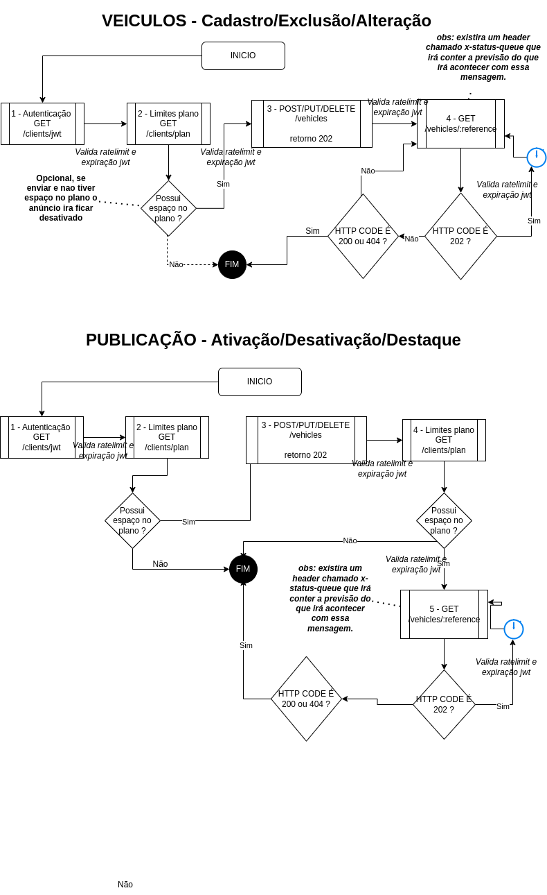

# API REST Veículos (v2)

- [Considerações iniciais](/docs/01-consideracoes-iniciais/index.md)
    - [Ambiente de testes](docs/01-consideracoes-iniciais/test-environment.md)
    - [Ambiente de produção](docs/01-consideracoes-iniciais/production-environment.md)
    - [Autenticação](docs/01-consideracoes-iniciais/authentication.md)
    - [Limite de requisições](docs/01-consideracoes-iniciais/limit-requests.md)
    - [Status de respostas das requisições](docs/01-consideracoes-iniciais/status-request.md)
    - [Paginação e busca](docs/01-consideracoes-iniciais/pagination-and-search.md)

- [Veículos](docs/02-veiculos/index.md)
    - [Endpoints](docs/02-veiculos/vehicle-endpoints.md)
    - [Endpoints paginados](docs/02-veiculos/vehicle-endpoints-paginated)    
    - [Objeto para criação e edição do veículo](docs/02-veiculos/vehicle-object.md)
    - [Objeto de retorno /vehicles/{reference}](docs/02-veiculos/vehicle-return-object.md)

- [Cliente](docs/03-cliente/index.md)
    - [Endpoints](docs/03-cliente/client-endpoints.md)
    - [Objeto de informações do plano](docs/03-cliente/plan-information-object.md)

- [Publicação](docs/04-publicacao/index.md)
    - [Endpoints](docs/04-publicacao/publication-endpoints.md)
    - [Objeto de informações da publicação](docs/04-publicacao/publication-information-object.md)

- [Previsão de execução de requisição - HEADER `x-status-queue`](docs/05-previsao-execucao/index.md)
    

## Fluxograma de comportamento esperado

